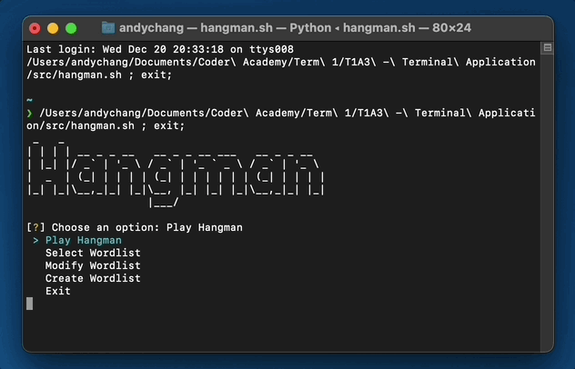

<h1 align="center">
   
  </img>
   
  Andy Chang
   
</h1>

<h3 align="center">
 <h3 align="center">
<a href="https://github.com">📦 Github Repo</a>
 </h3>

 <h3 align="center">
<a href="https://www.canva.com>🎬 Presentation Video</a>
 </h3>

<h2 align="center">Documentation for T1A3 - Terminal Application</h4>

  <a href="#💡-purpose">Purpose</a> •
  <a href="#⚙️-functionality">Functionality</a> •
  <a href="#📀-installation">Installation</a> •
  <a href="#📝-implementation-plan">Implementation Plan</a> •
  <a href="#💻-application-walkthrough">Application Walkthrough</a> •
  <a href="#📚-references">References</a>

## 💡 Purpose

- Lorem ipsum dolor sit amet, consectetur adipiscing elit, sed do eiusmod tempor incididunt ut labore et dolore magna aliqua.

## ⚙️ Functionality

- Feature 1
- Feature 2
- Feature 3

> **Note:**
> Extra Notes

## 📀 Installation

### System Requirements
- Lorem ipsum dolor sit amet, consectetur adipiscing elit, sed do eiusmod tempor incididunt ut labore et dolore magna aliqua.

### App Dependencies
- Lorem ipsum dolor sit amet, consectetur adipiscing elit, sed do eiusmod tempor incididunt ut labore et dolore magna aliqua.

## 📝 Implementation Plan

## 💻 Application Walkthrough

Lorem ipsum dolor sit amet, consectetur adipiscing elit, sed do eiusmod tempor incididunt ut labore et dolore magna aliqua.

## 📚 References

### Code Style Guide

This terminal guide adheres to the Python Enhancement Proposal 8 (PEP 8) coding style guide, established by Guido van Rossum, Barry Warsaw, and Nick Coghlan.

### Third Party Resources
This terminal uses the following third-party resources:
